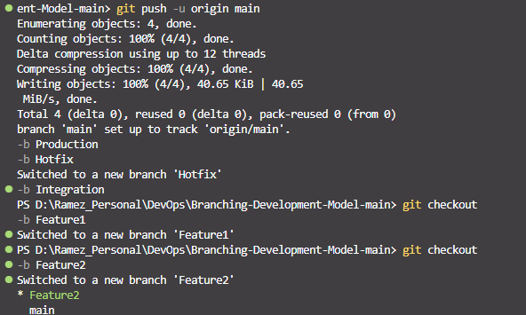
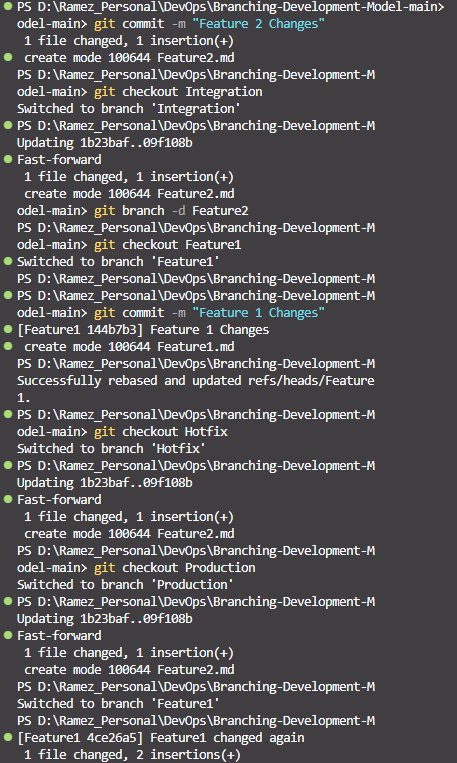
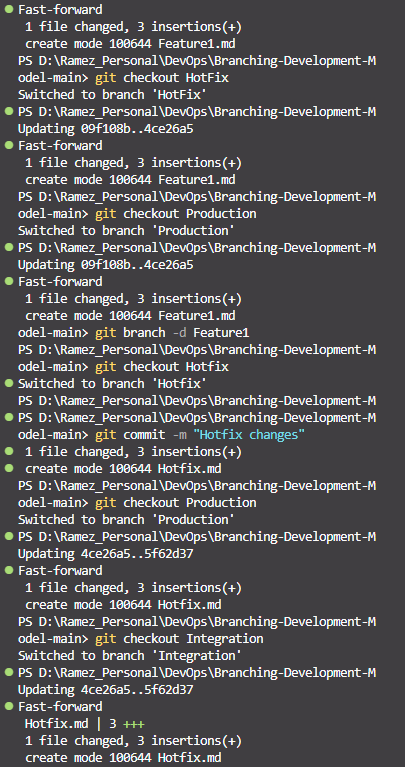
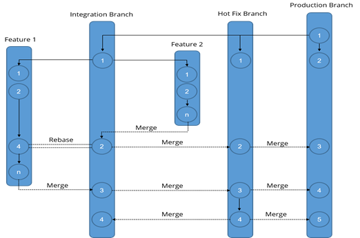

# Solution
1. Initialize Repository and Create Branches:
- git init
- git checkout -b Production
- git checkout -b Hotfix Production
- git checkout -b Integration Production
2. Create Feature Branches:
- git checkout -b Feature1 Integration
- git checkout -b Feature2 Integration

3. Commit and Merge in Feature Branches:
- git checkout Feature2
- git add .
- git commit -m "Feature 2 changes"
- git checkout Integration
- git merge Feature2
- git branch -d Feature2
- git checkout Feature1
- git add .
- git commit -m "Feature 1 changes"
- git rebase Integration
4. Update Hotfix and Production Branches:
- git checkout Hotfix
- git merge Integration
- git checkout Production
- git merge Integration
5. Further Changes and Merging:
- git checkout Feature1
- git add .
- git commit -m "Further Feature 1 changes"

- git checkout Integration
- git merge Feature1
- git checkout Hotfix
- git merge Feature1
- git checkout Production
- git merge Feature1
- git branch -d Feature1
- git checkout Hotfix
- git add .
- git commit -m "Hotfix changes"
- git checkout Production
- git merge Hotfix
- git checkout Integration
- git merge Hotfix

By following these steps, you'll be able to create and manage a branching model that follows the Git Feature Branch Workflow as described. This will help your team understand how to integrate their work efficiently and manage different branches for development, testing, and production.
